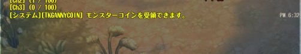

# tkgannycoin

## Descriptions

JPサーバの「帰ってきた碧き結晶とモンスター」イベント用のアドオンです。
モンスターコイン未受領の場合に通知します。

[tkgnotifier](https://github.com/tokageel/tos/tree/master/addons/tkgnotifier)を導入済みの場合は連携し、未導入の場合はチャットウィンドウにシステムメッセージとして表示します。

## Usage

期間限定のイベント向けアドオンのため、アドオンマネージャには登録していません。
手動でインストールしてください。

## Configuration

設定項目はありません。

## Others

* 日本サーバでしか動作しません。
* イベント期間は2019年1月30日（水）までだそうなので、2019年1月30日（水）12:00以降は動作しないようにしています。アンインストールしてください。
* イベントに参加できるのはベースレベル30からだそうですが、このアドオンではチェックしません。
