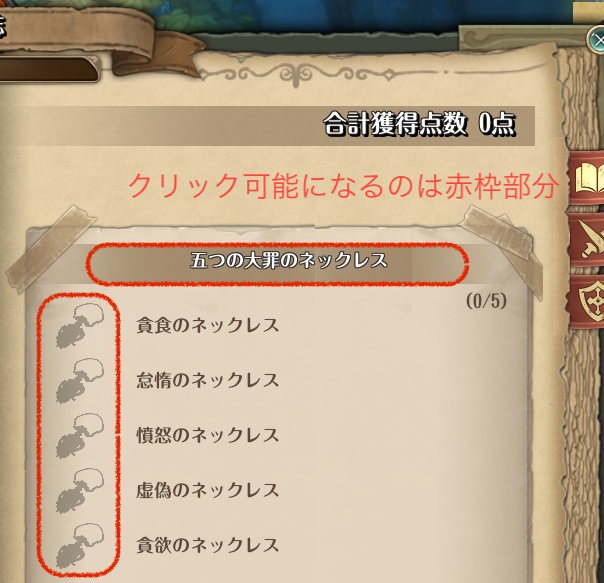

# tkgbrowser

## Descriptions

冒険日誌ウィンドウのコレクション画面からWindowsの規定ブラウザを起動し、[tosjbase](https://tos-jp.neet.tv/)のアイテム検索結果を表示するためのアドオンです。

`os.execute()`で`START http://〜〜〜〜`してるだけです。



## Usage

アドオンマネージャには登録していませんので、手動でのインストールが必要です。
ただし、アドオンの動作にはacutilが必要です。

通常のアドオンと同様、下記のようなファイル構成とします。

```bash
<ToSインストール先>
├addons/
│ └_tkgbrowser-🦎-vX.X.X.ipf: ダウンロードしたファイルを格納
└data/
   └tkgbrowser/: 手動でフォルダを作成する
     └settings.json: 任意
```

## Configuration

settings.jsonファイルを手動で作成することで、ブラウザで表示するURLを変更することができます。

* キー名は`base_url_item`です
* URL内の`'/'`の記号は`'$'`に置き換えてください
* `'%s'`部分にクリックしたアイテムのClassIDが渡されます

[tosドロップサーチ \- ぅぅぃ](http://ir-norn.github.io/tool/tos/p.html) を使用する場合は以下のような設定になります。
```json
{"base_url_item":"http:$$ir-norn.github.io$tool$tos$p.html?page=%s"}
```
