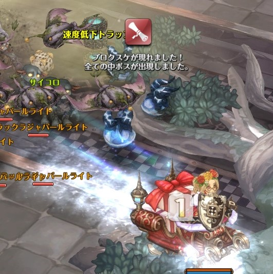

# tkgcastleprogress

## Descriptions

サルラス修道院のキャッスルミッションで、進捗度（ボスの出現具合）を目につく位置に表示するアドオンです。

* ダイス選択を正解するたびに自キャラ周辺にカウントダウンのアイコンを表示し、効果音を鳴動
  * カウント3: モヤブルカPOP
  * カウント2: モステムPOP
  * カウント1: プロクスケPOP
  * カウント0: ウェアウルフPOP

## Usage

アドオンマネージャ経由でインストールしてください。

## Configuration

設定項目はありません。
