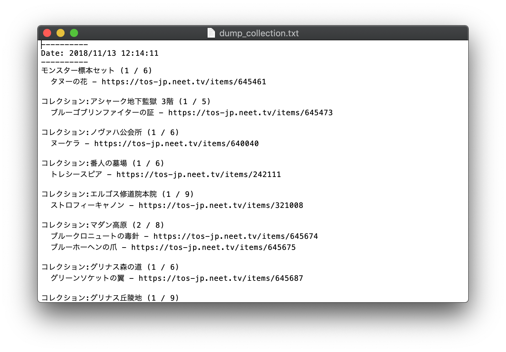

# scripts
単発実行のスクリプト類などをおきます.

## dump_collections.lua
未収集のコレクションアイテムとテキストに出力します.
繰り返し実行するようなものでもないので、UIは作りませんでした.

### Installation

1. Developerコンソールをインストールしておく.
2. dump_collections.lua をToSのインストール先（デフォルトだとC:¥Nexon¥TreeofSaviorJP¥）におく

### Usage
1. チャット欄に`/dev`と入力してコンソールを開く
2. コンソールに`dofile("../dump_collections.lua")`と入力する

ToSのインストール先にdump_collection.txtというテキストファイルが出力されます.
出力形式は以下のような形です.

